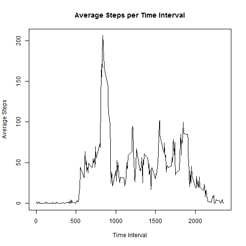
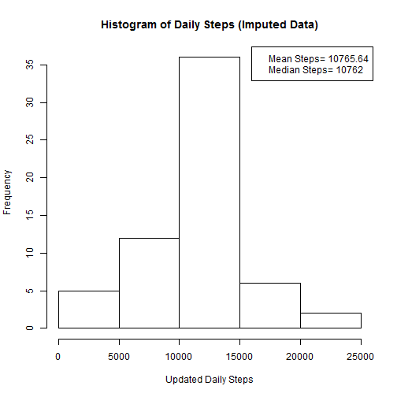
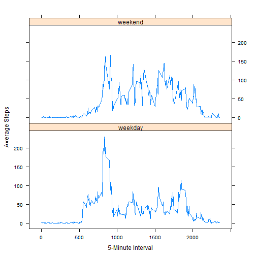

## Loading and preprocessing the data

```r
require(dplyr)
rawactivity<- tbl_df(read.csv(file="activity.csv"))
```


## What is mean total number of steps taken per day?
1. Create dataset just with steps by date, removing rows where steps is NA

```r
dailysteps <-
    rawactivity %>% 
        filter(!is.na(steps)) %>%
        select(-interval) %>%
        group_by(date) %>%
        summarise(totalsteps = sum(steps))
```

2. Create histogram of daily steps

```r
hist(dailysteps$totalsteps,xlab="Daily Steps",main="Histogram of Daily Steps")
```

 

3. Calculate and report the mean and median of the total number of steps taken per day

```r
dailysteps %>% summarise(MeanSteps=mean(totalsteps),MedianSteps=median(totalsteps))
```

```
## Source: local data frame [1 x 2]
## 
##   MeanSteps MedianSteps
##       (dbl)       (int)
## 1  10766.19       10765
```

## What is the average daily activity pattern?
1. Make a time series plot (i.e. type = "l") of the 5-minute interval (x-axis) and the average number of steps taken, averaged across all days (y-axis)

```r
# Creating table for data; NAs are removed from mean calculation
intervalsteps <-
    rawactivity %>%
        select(-date) %>%
        group_by(interval) %>%
        summarise(averagesteps = mean(steps, na.rm=TRUE))

# Making time series plot    
with(intervalsteps,plot(interval,averagesteps,type="l",xlab="Time Interval",ylab="Average Steps",main="Average Steps per Time Interval"))
```

 

2. Which 5-minute interval, on average across all the days in the dataset, contains the maximum number of steps?

```r
# Returning interval with max average steps
filter(intervalsteps,averagesteps==max(averagesteps))
```

```
## Source: local data frame [1 x 2]
## 
##   interval averagesteps
##      (int)        (dbl)
## 1      835     206.1698
```
#####    Interval with maximum number of steps is the 835 interval.
## Imputing missing values
1. Calculate and report the total number of missing values in the dataset (i.e. the total number of rows with NAs)


```r
# Returning count of rows where steps is NA
rawactivity %>% 
    filter(is.na(steps)) %>% 
    summarise(CountMissingValues = n())
```

```
## Source: local data frame [1 x 1]
## 
##   CountMissingValues
##                (int)
## 1               2304
```
#####    Number of rows with missing values is 2304.

2. Devise a strategy for filling in all of the missing values in the dataset. The strategy does not need to be sophisticated. 


```r
# Creating dataset containing only activity rows with missing steps and then using ROUNDED average value per interval from intervalsteps dataset created earlier to replace NAs in said dataset.
naactivity <- filter(rawactivity,is.na(steps))
naactivity$steps <- round(intervalsteps$averagesteps[match(naactivity$interval,intervalsteps$interval)])
```

3. Create a new dataset that is equal to the original dataset but with the missing data filled in.

```r
# Creating dataset containing only rows without missing values and then combining that with dataset containing rows now holding average steps per interval rather than NAs (per step above)
updatedactivity <- rbind(naactivity,(filter(rawactivity,!is.na(steps))))
```

4. Make a histogram of the total number of steps taken each day and Calculate and report the mean and median total number of steps taken per day. 

```r
# Creating table from updated activity with new total steps per day
updateddailysteps <-
    updatedactivity %>%
        select(-interval) %>%
        group_by(date) %>%
        summarise(totalsteps = sum(steps))
# Creating histogram of updated table; mean and median steps taken per day are in legend of histogram
hist(updateddailysteps$totalsteps,xlab="Updated Daily Steps",main="Histogram of Daily Steps (Imputed Data)")
legend(x = "topright",
        c(paste("Mean Steps=",round(mean(updateddailysteps$totalsteps),2)),
          paste("Median Steps=",round(median(updateddailysteps$totalsteps),2))))
```

 

Do these values differ from the estimates from the first part of the assignment? What is the impact of imputing missing data on the estimates of the total daily number of steps?

```r
# Comparing Mean/Median from sets without imputed data and with imputed data
aggactivity <- dailysteps %>% summarise(MeanSteps=mean(totalsteps),MedianSteps=median(totalsteps))
aggactivity <- rbind(aggactivity, 
                    (updateddailysteps %>% 
                         summarise(MeanSteps=mean(totalsteps),MedianSteps=median(totalsteps))))
aggactivity <- cbind(aggactivity,"ImputedDataIncluded"=c("N","Y"))
aggactivity
```

```
##   MeanSteps MedianSteps ImputedDataIncluded
## 1  10766.19       10765                   N
## 2  10765.64       10762                   Y
```
#####   Answer: After imputing values, both the Mean and Median step values decreased from their values prior to imputing data.
## Are there differences in activity patterns between weekdays and weekends?
1. Create a new factor variable in the dataset with two levels - "weekday" and "weekend" indicating whether a given date is a weekday or weekend day.


```r
# Creating factor variable per directions

updatedactivity$weekdayorweekend<-as.factor(weekdays(as.Date(updatedactivity$date)))
levels(updatedactivity$weekdayorweekend) <- c("weekday","weekday","weekend","weekend","weekday","weekday","weekday")
levels(updatedactivity$weekdayorweekend)
```

```
## [1] "weekday" "weekend"
```

2. Make a panel plot containing a time series plot (i.e. type = "l") of the 5-minute interval (x-axis) and the average number of steps taken, averaged across all weekday days or weekend days (y-axis). 

```r
# Creating subset of data with average steps calculated.
factoredsteps <-
    updatedactivity %>%
    select(steps,interval,weekdayorweekend) %>%
    group_by(interval,weekdayorweekend) %>%
    summarise(averagesteps = mean(steps))

# Creating plot showing average steps broken down by weekday/weekend using lattice plot system
require(lattice)
xyplot(averagesteps~interval|as.factor(weekdayorweekend),data=factoredsteps,layout=c(1,2),type="l",ylab="Average Steps",xlab="5-Minute Interval")
```

 
